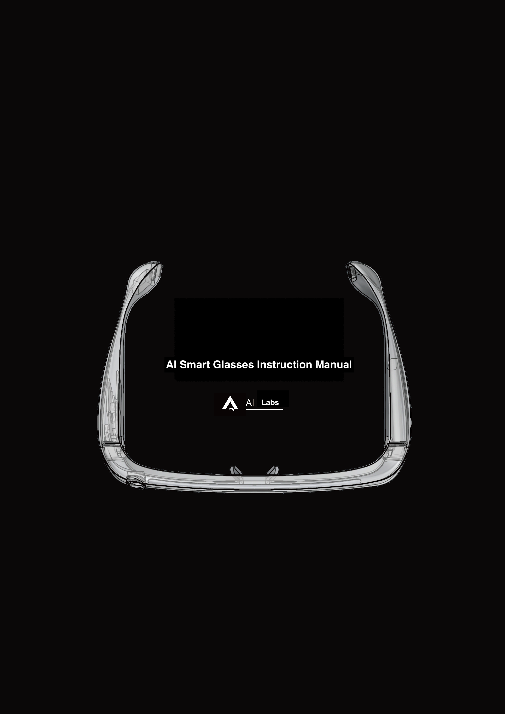
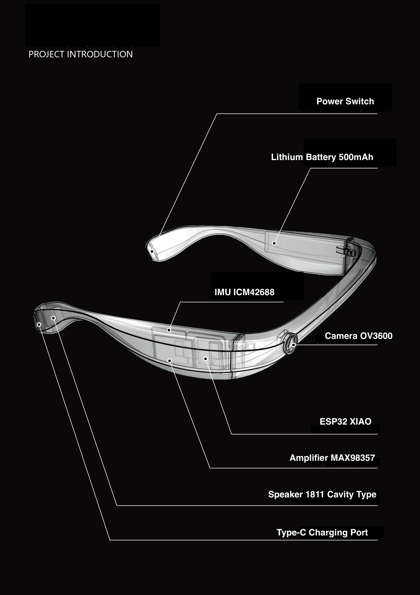

# AI Smart Glasses System for the Visually Impaired 🤖👓

<div align="center">

An intelligent navigation and assistance system designed for visually impaired individuals, integrating tactile-path navigation, crosswalk assistance, object recognition, and real-time voice interaction.  
⚠️ *This project is for research and educational purposes only. Do not use it directly with visually impaired users without professional supervision.*

[Features](#-features) • [Quick Start](#-quick-start) • [System Architecture](#-system-architecture) • [User Guide](#-user-guide) • [Developer Documentation](#-developer-documentation)

</div>

---






## 📋 Table of Contents

- [Features](#-features)
- [System Requirements](#-system-requirements)
- [Quick Start](#-quick-start)
- [System Architecture](#-system-architecture)
- [Usage Guide](#-user-guide)
- [Configuration](#-configuration-guide)
- [Developer Documentation](#-developer-documentation)
- [FAQ](#-faq)
- [Contribution Guidelines](#contribution-guidelines)
- [License](#-license)
- [Acknowledgments](#acknowledgments)

---

## ✨ Features

### 🚶 Tactile Path Navigation
- **Real-time path detection** — detects tactile paving paths with YOLO segmentation.
- **Smart voice guidance** — provides precise directional prompts (turn left, right, straight, etc.).
- **Obstacle detection and avoidance** — identifies obstacles ahead and plans avoidance routes.
- **Turn detection** — detects sharp turns and gives early voice warnings.
- **Optical flow stabilization** — uses Lucas–Kanade optical flow to stabilize mask tracking.

### 🚦 Crosswalk Assistance
- **Crosswalk detection** — detects zebra crossings in real time.
- **Traffic light detection** — identifies light states via color and shape.
- **Alignment guidance** — helps align to the crosswalk center.
- **Safety prompts** — announces when the light is green to cross safely.

### 🔍 Object Recognition & Search
- **Voice-based search** — e.g. “find the Red Bull for me.”
- **Real-time tracking** — YOLO-E open vocabulary detection + ByteTrack tracking.
- **Hand guidance** — uses MediaPipe hand detection to guide hand position.
- **Grasp detection** — detects grasp motion confirming the object is picked up.
- **Multi-modal feedback** — visual overlay + audio + centering cue.

### 🎙️ Real-Time Voice Interaction
- **Speech Recognition (ASR)** — powered by Alibaba DashScope Paraformer.
- **Multimodal conversation** — Qwen-Omni-Turbo supports image + text input with speech output.
- **Smart command parsing** — distinguishes navigation, search, and chat.
- **Context awareness** — ignores irrelevant commands in the wrong mode.

### 📹 Video & Audio Processing
- **Real-time video streaming** — via WebSocket, supports multiple viewers.
- **Audio/video recording** — saves synchronized recordings with timestamps.
- **IMU fusion** — supports ESP32 IMU data for pose estimation.
- **Multi-channel audio mixing** — system voice, AI responses, ambient audio together.

### 🎨 Visualization & Interaction
- **Web dashboard** — view processed video in real time.
- **3D IMU visualization** — real-time rendering via Three.js.
- **Status panel** — shows current navigation state, detections, FPS, etc.
- **Chinese UI (customizable)** — all UI and speech currently in Chinese, can be localized.

---

## 💻 System Requirements

### Hardware
**Server / Development**
- CPU: Intel i5 or above (i7/i9 recommended)  
- GPU: NVIDIA GPU with CUDA 11.8+ (RTX 3060 or higher recommended)  
- RAM: 8 GB (min) / 16 GB (recommended)  
- Storage: 10 GB free  

**Client (optional)**
- ESP32-CAM or WebSocket camera  
- Microphone  
- Speaker/headphones  

### Software
- OS: Windows 10/11, Ubuntu 20.04+, macOS 10.15+  
- Python 3.9 – 3.11  
- CUDA 11.8 or higher (for GPU)  
- Browser: Chrome 90+, Firefox 88+, Edge 90+  

### API Keys
- **Alibaba DashScope API Key** (required)  
  For speech recognition and Qwen-Omni dialogue.  
  → <https://dashscope.console.aliyun.com/>

---

## 🚀 Quick Start

### 1. Clone
```bash
git clone https://github.com/yourusername/aiglass.git
cd aiglass/rebuild1002
```

### 2. Install Dependencies
```bash
python -m venv venv
# Windows
venv\Scripts\activate
# Linux/macOS
source venv/bin/activate
pip install -r requirements.txt
```


#### Install CUDA and cuDNN (GPU Acceleration)

Please refer to the [NVIDIA CUDA Toolkit Installation Guide](https://developer.nvidia.com/cuda-downloads)

### 3. Download Model Files

Place the following model files into the `model/` directory:

| Model File             | Purpose                   | Size  | Download Link                                                                                       |
| ---------------------- | ------------------------- | ----- | --------------------------------------------------------------------------------------------------- |
| `yolo-seg.pt`          | Blind path segmentation   | ~50MB | [To be added]                                                                                       |
| `yoloe-11l-seg.pt`     | Open vocabulary detection | ~80MB | [To be added]                                                                                       |
| `shoppingbest5.pt`     | Object recognition        | ~30MB | [To be added]                                                                                       |
| `trafficlight.pt`      | Traffic light detection   | ~20MB | [To be added]                                                                                       |
| `hand_landmarker.task` | Hand detection            | ~15MB | [MediaPipe Models](https://developers.google.com/mediapipe/solutions/vision/hand_landmarker#models) |

### 4. Configure API Key

Create a `.env` file:

```bash
# .env
DASHSCOPE_API_KEY=your_api_key_here
```
Or modify it directly in the code (not recommended):
```
# app_main.py, line 50
API_KEY = "your_api_key_here"
```

### 5. Start the System

```bash
python app_main.py
```
The system will start at http://0.0.0.0:8081.
Open your browser to access the real-time monitoring interface.

## 6. Connect Devices (optional)

If you are using an **ESP32-CAM**, follow these steps:

1. Flash `compile/compile.ino` onto the ESP32.  
2. Update the Wi-Fi configuration so it connects to the same network as the server.  
3. The ESP32 will automatically connect to the WebSocket endpoint.

---

## 🏗  System Architecture

### 🧩 Overall Architecture
```
┌─────────────────────────────────────────────────────────────┐
│                        Client Layer                         │
│  ┌──────────────┐  ┌──────────────┐  ┌──────────────┐       │
│  │  ESP32-CAM   │  │   Browser    │  │   Mobile     │       │
│  │ (Video/Audio)│  │ (Monitoring) │  │ (Voice Ctrl) │       │
│  └──────┬───────┘  └──────┬───────┘  └──────┬───────┘       │
└─────────┼──────────────────┼──────────────────┼──────────────┘
│ WebSocket        │ HTTP/WS          │ WebSocket
┌─────────┼──────────────────┼──────────────────┼──────────────┐
│         │                  │                  │              │
│    ┌────▼──────────────────▼──────────────────▼────────┐     │
│    │             FastAPI Main Service (app_main.py)    │     │
│    │  - WebSocket routing management                   │     │
│    │  - Audio/video stream distribution                │     │
│    │  - State coordination                             │     │
│    └────┬────────────────┬────────────────┬────────────┘     │
│         │                │                │                  │
│  ┌──────▼──────┐  ┌──────▼──────┐  ┌──────▼──────┐          │
│  │ ASR Module   │  │ Omni Dialog │  │ Audio Player│          │
│  │ (asr_core)   │  │(omni_client)│  │(audio_player)│        │
│  └──────────────┘  └──────────────┘  └──────────────┘        │
│                                                              │
│                        Application Layer                     │
└──────────────────────────────────────────────────────────────┘
│                  │                  │
┌─────────▼──────────────────▼──────────────────▼──────────────┐
│                     Navigation Control Layer                 │
│    ┌─────────────────────────────────────────────────┐       │
│    │  NavigationMaster (navigation_master.py)         │       │
│    │  - State machine: IDLE / CHAT / BLINDPATH_NAV / │       │
│    │    CROSSING / TRAFFIC_LIGHT / ITEM_SEARCH        │       │
│    │  - Mode switching and coordination               │       │
│    └───┬─────────────────────┬───────────────────┬────┘       │
│        │                     │                   │            │
│   ┌────▼────────┐   ┌────────▼────────┐   ┌─────▼──────┐     │
│   │ Blind Path   │   │ Cross Street    │   │ Item Search │     │
│   │(blindpath)   │   │(crossstreet)    │   │(yolomedia)  │     │
│   └──────────────┘   └─────────────────┘   └─────────────┘     │
└───────────────────────────────────────────────────────────────┘
│                  │                  │
┌─────────▼──────────────────▼──────────────────▼──────────────┐
│                       Model Inference Layer                  │
│  ┌──────────────┐  ┌──────────────┐  ┌──────────────┐       │
│  │ YOLO Segmentation │  │ YOLO-E Detection │  │ MediaPipe │ │
│  │ (Tactile/Crosswalk)│ │ (Open Vocabulary)│ │ (Hand Tracking)││
│  └──────────────┘  └──────────────┘  └──────────────┘       │
│  ┌──────────────┐  ┌──────────────┐                         │
│  │ Traffic Light │  │ Optical Flow │                         │
│  │ (HSV + YOLO)  │  │ (Lucas-Kanade)│                        │
│  └──────────────┘  └──────────────┘                         │
└──────────────────────────────────────────────────────────────┘
│
┌─────────▼────────────────────────────────────────────────────┐
│                    External Services Layer                   │
│  ┌──────────────────────────────────────────────┐            │
│  │  AliCloud DashScope API                      │            │
│  │  - Paraformer ASR (Real-time Speech-to-Text) │            │
│  │  - Qwen-Omni-Turbo (Multimodal Dialogue)     │            │
│  │  - Qwen-Turbo (Tag Extraction)               │            │
│  └──────────────────────────────────────────────┘            │
└──────────────────────────────────────────────────────────────┘
```


### 🔧 Core Module Overview

| Module | File | Function |
|---------|------|-----------|
| **Main Application** | `app_main.py` | FastAPI service, WebSocket management, and system coordination |
| **Navigation Master** | `navigation_master.py` | State machine management, mode switching, voice throttling |
| **Blind Path Navigation** | `workflow_blindpath.py` | Tactile path detection, obstacle avoidance, and turn guidance |
| **Crosswalk Navigation** | `workflow_crossstreet.py` | Crosswalk detection, traffic light recognition, and alignment guidance |
| **Item Search** | `yolomedia.py` | Object detection, hand guidance, and grasp confirmation |
| **Speech Recognition (ASR)** | `asr_core.py` | Real-time ASR, VAD (Voice Activity Detection), and command parsing |
| **Speech Synthesis (TTS)** | `omni_client.py` | Qwen-Omni streaming speech generation |
| **Audio Playback** | `audio_player.py` | Multi-channel mixing, TTS playback, and volume control |
| **Video Recording** | `sync_recorder.py` | Audio and video synchronized recording |
| **Bridge I/O** | `bridge_io.py` | Thread-safe frame buffering and distribution |


## 📖 User Guide

### 🎙️ Voice Commands

The system supports the following voice commands — **no wake word required**:

#### 🧭 Navigation Control
```
"Start navigation" / "Blind path navigation" → Start tactile path navigation
"Stop navigation" / "End navigation" → Stop tactile path navigation
"Start crossing" / "Help me cross the street" → Start crosswalk navigation mode
"Stop crossing" / "End crossing" → Stop crosswalk mode
```
#### 🚦 Traffic Light Detection 

```
"Detect traffic light" / "Check the traffic light" → Start traffic light detection
"Stop detection" / "Stop traffic light" → Stop traffic light detection
```

#### 🔍 Item Search
```
"Find [item name]" → Start object search
Examples:

"Find Red Bull"

"Find AD Calcium Milk"

"Find mineral water"
"Found it" / "Got it" → Confirm that the item has been found or picked up
```

#### 💬 Smart Interaction
```
"Tell me what this is" → Capture image and identify object
"Can I eat this?" → Ask about an item
Any other question → Start AI conversation
```

### 🧭 Navigation Status Overview

The system includes the following main states (automatically switched):

1. **IDLE** – *Idle State*  
   - Waiting for user commands  
   - Displays raw video stream  

2. **CHAT** – *Dialogue Mode*  
   - Engages in multimodal conversation with the AI  
   - Navigation temporarily paused  

3. **BLINDPATH_NAV** – *Tactile Path Navigation*  
   - **ONBOARDING**: Guiding onto the tactile path  
     - **ROTATION**: Aligning with the path direction  
     - **TRANSLATION**: Moving to the center of the path  
   - **NAVIGATING**: Following the tactile path  
     - Real-time direction correction  
     - Obstacle detection and avoidance  
   - **MANEUVERING_TURN**: Handling turns  
   - **AVOIDING_OBSTACLE**: Obstacle avoidance  

4. **CROSSING** – *Crosswalk Mode*  
   - **SEEKING_CROSSWALK**: Searching for crosswalk  
   - **WAIT_TRAFFIC_LIGHT**: Waiting for green light  
   - **CROSSING**: Crossing the street  
   - **SEEKING_NEXT_BLINDPATH**: Searching for the tactile path on the other side  

5. **ITEM_SEARCH** – *Item Search Mode*  
   - Detects target object in real time  
   - Guides user’s hand toward the object  
   - Confirms successful grasp  

6. **TRAFFIC_LIGHT_DETECTION** – *Traffic Light Detection*  
   - Detects real-time traffic light status  
   - Provides voice feedback for color changes  

---

### 🖥️ Web Monitoring Interface

Open your browser and visit `http://localhost:8081` to view:

- **Real-Time Video Stream** – Displays processed video with navigation overlays  
- **Status Panel** – Shows current mode, detection info, and FPS  
- **IMU Visualization** – 3D rendering of device orientation  
- **Speech Recognition Results** – Displays recognized speech and AI responses  

---

### 🔌 WebSocket Endpoints

| Endpoint | Purpose | Data Format |
|-----------|----------|-------------|
| `/ws/camera` | ESP32 camera streaming | Binary (JPEG) |
| `/ws/viewer` | Browser video viewer | Binary (JPEG) |
| `/ws_audio` | ESP32 audio upload | Binary (PCM16) |
| `/ws_ui` | UI status updates | JSON |
| `/ws` | IMU data input | JSON |
| `/stream.wav` | Audio stream download | Binary (WAV) |


## ⚙️ Configuration Guide

### 🌍 Environment Variables

Create a `.env` file and set the following parameters:

```bash
# AliCloud API
DASHSCOPE_API_KEY=sk-xxxxx

# Model paths (optional — can be omitted if using default)
BLIND_PATH_MODEL=model/yolo-seg.pt
OBSTACLE_MODEL=model/yoloe-11l-seg.pt
YOLOE_MODEL_PATH=model/yoloe-11l-seg.pt

# Navigation parameters
AIGLASS_MASK_MIN_AREA=1500      # Minimum mask area
AIGLASS_MASK_MORPH=3            # Morphological kernel size
AIGLASS_MASK_MISS_TTL=6         # Frame tolerance for mask loss
AIGLASS_PANEL_SCALE=0.65        # Data panel scale

# Audio configuration
TTS_INTERVAL_SEC=1.0            # Interval between voice prompts
ENABLE_TTS=true                 # Enable text-to-speech output
```
### 🧠 Modify Model Paths

If the model files are not located in their default paths, you can update the corresponding files as follows:

```python
# workflow_blindpath.py
seg_model_path = "your/custom/path/yolo-seg.pt"

# yolomedia.py
YOLO_MODEL_PATH = "your/custom/path/shoppingbest5.pt"
HAND_TASK_PATH = "your/custom/path/hand_landmarker.task"
```

### ⚙️ Performance Tuning

Adjust the following parameters based on your hardware performance:

```python
# yolomedia.py
HAND_DOWNSCALE = 0.8    # Hand detection downscale (smaller = faster, but less accurate)
HAND_FPS_DIV = 1        # Frame skipping for hand detection (2 = every 2 frames, 3 = every 3 frames)

# workflow_blindpath.py  
FEATURE_PARAMS = dict(
    maxCorners=600,      # Number of optical flow feature points (fewer = faster)
    qualityLevel=0.001,  # Minimum quality of feature points
    minDistance=5        # Minimum distance between feature points
)
```
## 🛠️ Developer Documentation

### 🗣️ Adding a New Voice Command

1. In `app_main.py`, inside the `start_ai_with_text_custom()` function, add:

```python
# Check for a new custom command
if "your new keyword" in user_text:
    # Execute custom logic
    print("[CUSTOM] New command triggered")
    await ui_broadcast_final("[System] New feature activated")
    return
```
2. To modify the command filtering rules:

```python
# Update the allowed_keywords list
allowed_keywords = ["help me see", "help me find", "your new keyword"]
```

### 🚀 Extending Navigation Functionality

1. In `workflow_blindpath.py`, add a new state:

```python
# Initialize inside BlindPathNavigator.__init__()
self.your_new_state_var = False

# Handle it inside process_frame()
def process_frame(self, image):
    if self.your_new_state_var:
        # Custom processing logic
        guidance_text = "New state guidance"
    # ...
```

2. In `navigation_master.py`, add a new state to the state machine:

```python
class NavigationMaster:
    def start_your_new_mode(self):
        self.state = "YOUR_NEW_MODE"
        # Initialization logic
```

### 🤖 Integrating a New Model

1. Create a model wrapper class:

```python
# your_model_wrapper.py
class YourModelWrapper:
    def __init__(self, model_path):
        self.model = load_your_model(model_path)
    
    def detect(self, image):
        # Inference logic
        return results
```

2. Load the model in `app_main.py`:

```python
your_model = YourModelWrapper("model/your_model.pt")
```

3. Call it within the corresponding workflow:

```python
results = your_model.detect(image)
```
### 🧩 Debugging Tips

1. **Enable detailed logging:**

```python
# At the top of app_main.py
import logging
logging.basicConfig(level=logging.DEBUG)
```

2. **Check frame rate performance bottlenecks:**

```python
# yolomedia.py
PERF_DEBUG = True  # Print processing time per frame
```

3. **Test individual modules:**

```bash
# Test tactile path navigation
python test_cross_street_blindpath.py

# Test traffic light detection
python test_traffic_light.py

# Test recording feature
python test_recorder.py
```

## ❓ FAQ
TBD - The Original Chinese version has it in the Table of Contents but no actual section for this.

## Contribution Guidelines
TBD - The Original Chinese version has it in the Table of Contents but no actual section for this.

## 📄 License

This project is licensed under the **MIT License** — see the [LICENSE](LICENSE) file for details.

## Acknowledgments
TBD - The Original Chinese version has it in the Table of Contents but no actual section for this.